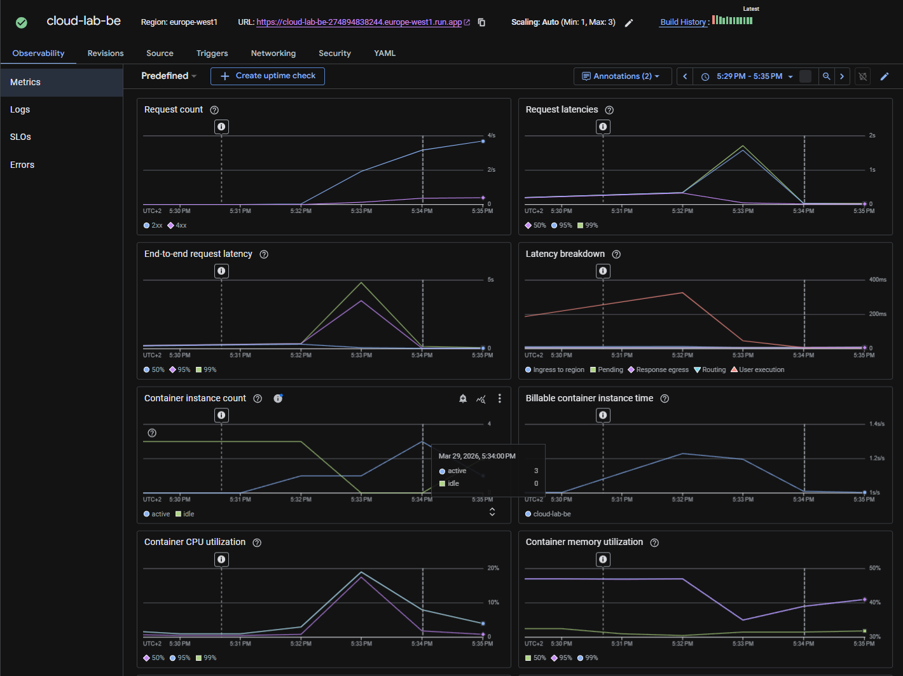
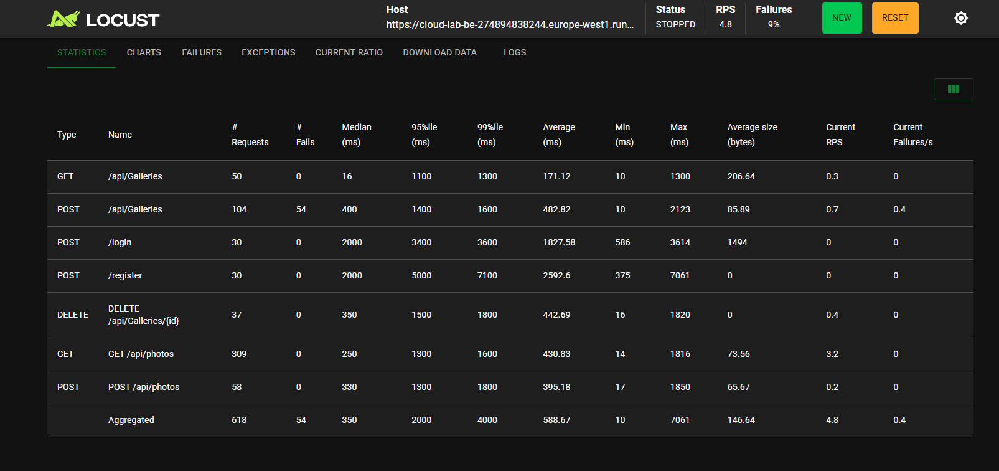
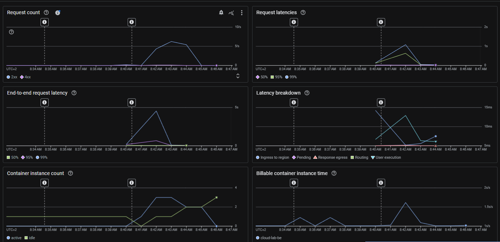
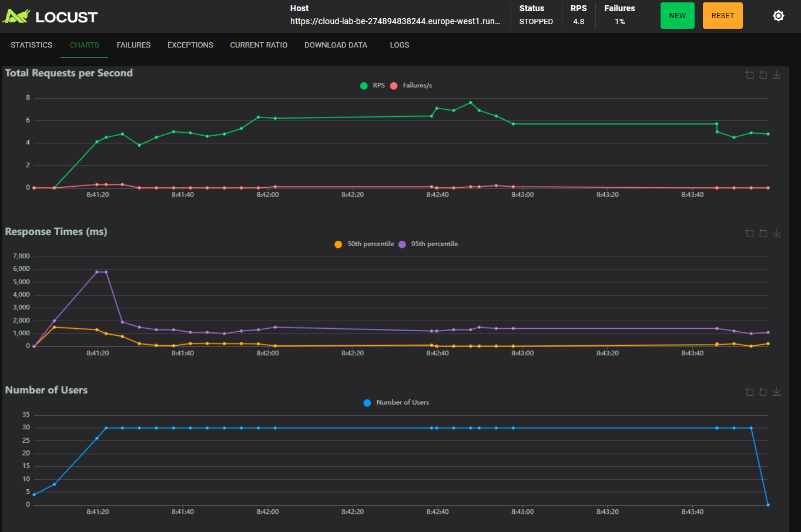
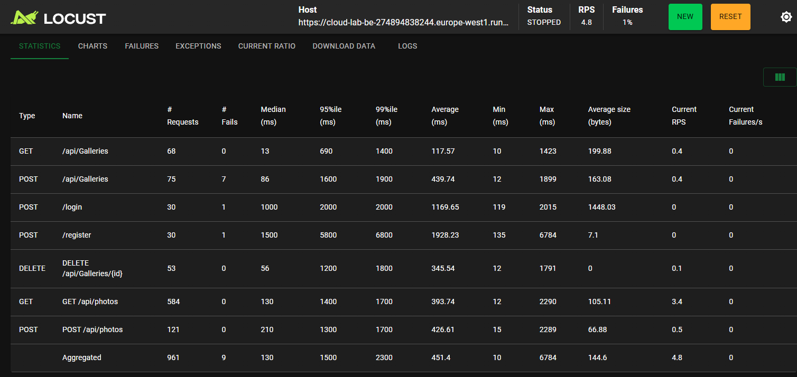

# Stressz teszt jegyzőkönyv

A teszt célja a Google Cloud Run skálázódási képességének mérése volt. A terhelést egy Locust szkript biztosította, ami szintén a Google Cloud hálózatán belül futott, így a hálózati késleltetés nem befolyásolta a mérést.

## Konfiguráció
* **Cloud Run:** Max 3 instance, max 10 concurrent requests per instance
* **Locust:** 30 user

## Locust workflow
A teszt egy életszerű folyamatot szimulál. Minden szál saját prefixet generál, amivel regisztrál és belép. A feladatok súlyozva vannak a reálisabb terhelés érdekében:
- **ensure_gallery:** Ellenőrzi, van-e élő galéria, ha nincs (induláskor vagy törlés után), létrehoz egyet.
- **list_photos (súly: 10):** A leggyakoribb művelet, ami folyamatosan lekéri a galéria tartalmát.
- **upload_photo (súly: 2):** Új képet tölt fel (test.jpg).
- **delete_everything (súly: 1):** Ritkábban fut le, letörli a galériát, így tesztelve a teljes életciklust.


## Eredmények

A mérés során a Cloud Run példányok száma a terhelés hatására dinamikusan emelkedett. Amikor a kérések száma átlépte a példányonkénti 10-es korlátot, a rendszer elindította a második, majd harmadik konténert is.



A Locust grafikonján is látszik, hogy a válaszidők stabilak maradtak a teszt alatt, látszódik, ahogy indulásnál elindítja a többi konténert is, ennek hatására van az elején a válaszidőkben egy kiugrás.


A statisztika alapján az átlagos válaszidő 500ms körül alakult, ami az adatbázis-műveletek és a képfeltöltések mellett jó teljesítményt jelent.



## Hibák elemzése
A teszt során megjelent pár 401 Unauthorized hiba. Ez feltehetően az architektúra sajátossága miatt van, mivel az új példányok indulásakor a tokeneket hitelesítő kulcsok szinkronizálása pár másodpercet igénybe vesz. Ezalatt a beérkező kéréseket a rendszer még nem tudja validálni. A többi funkcionális művelet (lista, feltöltés, törlés) a kezdeti bemelegedés után 0 hibával futott le.

## Hiba javítás és második eredmény
A fenti hibát az okozta, hogy a Cloud Run konténerek alapértelmezetten a saját memóriájukban tárolták a tokenek titkosítási kulcsait, így az új példányok elutasították a korábbiak által kiállított tokeneket. A .NET kódban a közös kulcstároló (`AddDataProtection()`) implementálásával ez az architekturális probléma elhárult.

### Az újratesztelés eredményei a javítás után:

A Cloud Run ismét stabilan és hibátlanul skálázódott a maximális 3 példányig.



A Locust grafikonjain látható, hogy a terhelés egyenletes, az extrém kiugrások kisimultak.



A skálázódásból eredő hitelesítési hibák teljesen megszűntek. Az összesített hibaarány az eredeti 9%-ról **1%-ra esett vissza**.



## locustfile.py
```py
from locust import HttpUser, task, between
import random, string

class PhotoAppUser(HttpUser):
    wait_time = between(1, 3)
    gallery_id = None

    def on_start(self):
        self.prefix = ''.join(random.choices(string.ascii_lowercase + string.digits, k=8))
        self.email, self.password = f"{self.prefix}@test.com", f"Pass_{self.prefix}"
        
        self.client.post("/register", json={"email": self.email, "password": self.password}, name="/register")
        res = self.client.post("/login", json={"email": self.email, "password": self.password}, name="/login")
        if res.status_code == 200:
            self.client.headers.update({"Authorization": f"Bearer {res.json().get('accessToken')}"})

    @task(1)
    def ensure_gallery(self):
        if self.gallery_id is None:
            res = self.client.post("/api/Galleries", json={"name": f"Gal_{self.prefix}", "isPublic": False}, name="/api/Galleries")
            if res.status_code == 200:
                gals = self.client.get("/api/Galleries?mine=true", name="/api/Galleries").json()
                if gals: self.gallery_id = gals[0].get("id")

    @task(10)
    def list_photos(self):
        if self.gallery_id:
            self.client.get(f"/api/photos?galleryId={self.gallery_id}", name="GET /api/photos")

    @task(2)
    def upload_photo(self):
        if self.gallery_id:
            files = {"File": ("test.jpg", b"fake_data", "image/jpeg")}
            self.client.post(f"/api/photos?galleryId={self.gallery_id}", data={"Name": "img"}, files=files, name="POST /api/photos")

    @task(1)
    def delete_everything(self):
        if not self.gallery_id: return
        
        self.client.delete(f"/api/Galleries/{self.gallery_id}", name="DELETE /api/Galleries/{id}")
        self.gallery_id = None
```